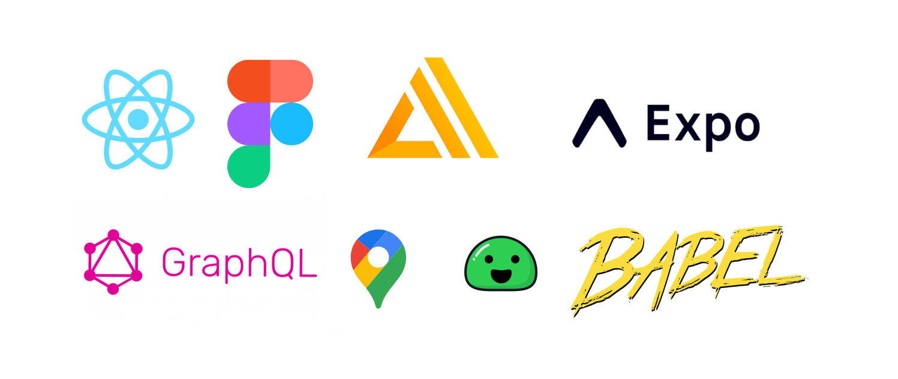

# Hungr

> Swipe. Match. Eat.

## Motivation

Before quarantine, going out to eat with your friends was fun, but
often difficult when deciding where to eat. You hear the
usual "wherever you want", offer suggestions, and are met with
disagreement.

**Hungr** aims to make these difficult and unproductive conversations
a thing of the past. Simply create a room and have your friends join,
and swipe away! When everyone swipes right on a restaurant, you have
found a place to eat!

## Our Technology

We used a wide range of open-source
technologies to build Hungr. While we weren't
necessarily experts in these, we still had a great experience developing
and learning! Here's some of the most notable ones.

### Google Places API

Using the **Google Places API**, we gather data from 
nearby restaurants for you to browse and choose from. Relevant
information, such as restaurant name, rating, and photos are displayed
in a card-like format, allowing you to make quick yet informed decisions
on where to eat your next meal.

### AWS Amplify

Our backend is supported by **AWS Amplify**, namely the DataStore
feature used to keep devices synced, providing a responsive and fast
experience. Using **GraphQL** queries, we were able to get the exact
data we need and limit the number of API calls.

### React Native

Since so many users are running different devices, using **React
Native** made cross-platform support effortless. We only needed one
codebase to develop on. Additionally, React Native allowed us to 
effectively translate our skills in React and web development into the 
mobile realm withour a steep learning curve.

### Docsify

Finally, this site for documentation was built using **Docsify**!
Writing Markdown and having it generate a good-looking site was
incredibly simple.

